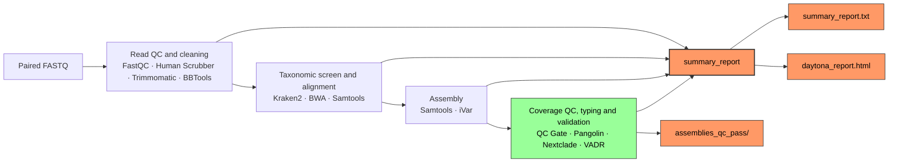

# Daytona

<p align="center">
  <em>⚠️ For research use only. Results were obtained by procedures that were not CLIA validated.</em>
</p>

<p align="center">
  
  
  
  
</p>

## 🦠🧬 Overview

Daytona is Florida BPHL's Nextflow pipeline for SARS-CoV-2 NGS data analysis. It processes paired-end Illumina reads through human read removal, quality control, adapter trimming, reference-based assembly, variant calling, lineage/clade assignment and GenBank submission validation.

Reads are aligned to the Wuhan-Hu-1 reference (`MN908947.3`) and primer-trimmed against an ARTIC primer scheme (default `ARTIC-V5.3.2`). [Pangolin](https://github.com/cov-lineages/pangolin) assigns Pango lineages and [Nextclade](https://github.com/nextstrain/nextclade) assigns Nextstrain clades using the current `sars-cov-2` dataset. Spike mutations of concern (SOTC) are screened from the Nextclade output, and [VADR](https://github.com/ncbi/vadr) validates consensus sequences for GenBank submission.

### ⚙️ Dependencies

- **Nextflow** 23.04–26.x - [installation guide](https://github.com/nextflow-io/nextflow)
- **Apptainer/Singularity** - [installation guide](https://apptainer.org/docs/user/latest/)
- **Conda** - [installation guide](https://docs.conda.io/projects/conda/en/latest/user-guide/install/index.html)
- **SLURM** workload manager (required for HiPerGator; otherwise not required)

All bioinformatics tools run inside containers, no additional software installation is required.

### 💻 Resource Requirements

Daytona is designed to run on an HPC environment but can run locally with sufficient resources.

- **CPUs:** 24 recommended; minimum 8
- **RAM:** 50 GB recommended; minimum 16 GB
- **Disk:** ~2–3 GB per sample (input + output)

### 🛠️ Setup

#### 1. Clone this repository and enter the repository directory

```bash
$ git clone https://github.com/BPHL-Molecular/Daytona

$ cd Daytona/
```

#### 2. Create the conda environment

```bash
$ conda create -n daytona -c conda-forge python=3.10
```

#### 3. Configure params.yaml

Edit `params.yaml` and set the input and output paths for your run:

```yaml
input:  "/full/path/to/fastqs"
output: "/full/path/to/output"
```

Both `input` and `output` must be absolute paths with no trailing slash. Optionally override `primer_scheme` (default `ARTIC-V5.3.2`) and `sotc` (default `S:L452R,S:E484K`).

#### 4. Configure daytona.sh

> At Florida BPHL we use **Apptainer** on HiPerGator for containerization. `daytona.sh` is pre-configured for SLURM + Apptainer and is the recommended submission method for HiPerGator users.

Add your email address for job notifications and set `NXF_APPTAINER_CACHEDIR` to your Apptainer image cache directory:

```bash
#SBATCH --mail-user=your@email.gov
export NXF_APPTAINER_CACHEDIR=/path/to/apptainer/cache
```

### How to Run

Place paired FASTQ files in the directory specified by `params.input`. Both Illumina native (`SAMPLE_S1_L001_R1_001.fastq.gz`) and simplified (`SAMPLE_1.fastq.gz`) naming conventions are supported. If no matching FASTQ files are found, the pipeline exits immediately with an error.

### 🐊 HiPerGator Usage

```bash
sbatch daytona.sh
```

### ⚡ Local Usage

```bash
# Apptainer/Singularity
nextflow run daytona.nf -profile apptainer -params-file params.yaml
```

### Workflow Diagram



> **QC GATE vs. assembly validation:** The **QC GATE** (`qc_flag`) is a minimum genome-breadth and read-depth check (≥80% genome covered, mean depth ≥100×) that gates **only VADR** (GenBank submission needs a complete genome). Pangolin and Nextclade run on **every** consensus, so a below-threshold genome still reports a lineage, clade, and SOTC — it just carries `qc_flag = FAIL` and `vadr_flag = FAIL`. Genome **assembly QC is performed by VADR**: a VADR **PASS** (`vadr_flag`) marks a submission-ready consensus, which is collected in `assemblies_qc_pass/`.

### 🧩 Modules

Daytona is made possible thanks to the following tools:

<small>

**Quality Control**: [FastQC](https://github.com/s-andrews/FastQC) 0.12.1 · [Trimmomatic](https://github.com/usadellab/Trimmomatic) 0.40 · [BBTools](https://github.com/bbushnell/BBTools) 39.84 · [MultiQC](https://github.com/MultiQC/MultiQC) 1.34

**Human Read Removal**: [NCBI SRA Human Scrubber](https://github.com/ncbi/sra-human-scrubber) 2.2.1

**Taxonomic Classification**: [Kraken2](https://github.com/DerrickWood/kraken2) 2.17.1 (viral)

**Reference-Based Assembly**: [BWA](https://github.com/lh3/bwa) 0.7.19 · [Samtools](https://github.com/samtools/samtools) 1.23.1 · [iVar](https://github.com/andersen-lab/ivar) 1.4.4

**Lineage Assignment**: [Pangolin](https://github.com/cov-lineages/pangolin) 4.4

**Clade Assignment**: [Nextclade](https://github.com/nextstrain/nextclade) 3.21.2 (`sars-cov-2` dataset)

**Submission Validation**: [VADR](https://github.com/ncbi/vadr) 1.7 (`sarscov2` model)

</small>

### 📁 Output

Per-sample results are written to `params.output/<sample_id>/`. A single summary file is written to `params.output/`:

```markdown
output/
├── <sample_id>/
│   ├── fastqc/
│   ├── fastqc_clean/
│   ├── humanscrubber/
│   ├── trimmomatic/
│   ├── bbtools/
│   ├── kraken2/
│   ├── samtools/
│   ├── ivar/
│   ├── vadr/
│   ├── pangolin/
│   ├── nextclade/
│   └── multiqc/
├── assemblies_qc_pass/
├── daytona_report.html
└── summary_report.txt
```

| File | Samples | Key fields |
|------|---------|------------|
| `summary_report.txt` | All | sample_id · reference · coverage stats · assembly stats · vadr_flag · qc_flag · pangolin_version · lineage · SOTC · kraken2_percent · nextclade_clade · nextclade_version |
| `daytona_report.html` | All | Interactive dashboard: lineage/clade and coverage QC, assembly QC, raw and clean FastQC, software versions |
| `assemblies_qc_pass/<sample_id>.consensus.fasta` | VADR PASS only | Submission-ready consensus sequences |
| `<sample_id>/multiqc/<sample_id>_multiqc_report.html` | Per sample | Raw + clean FastQC for that sample |

### 🤝 Contributing

We welcome contributions to make Daytona better! Feel free to open issues or submit pull requests to suggest additional features or enhancements.

### 📧 Contact

**Email**: [bphl-sebioinformatics@flhealth.gov](mailto:bphl-sebioinformatics@flhealth.gov)

### ⚖️ License

Daytona is licensed under the [MIT License](LICENSE).
